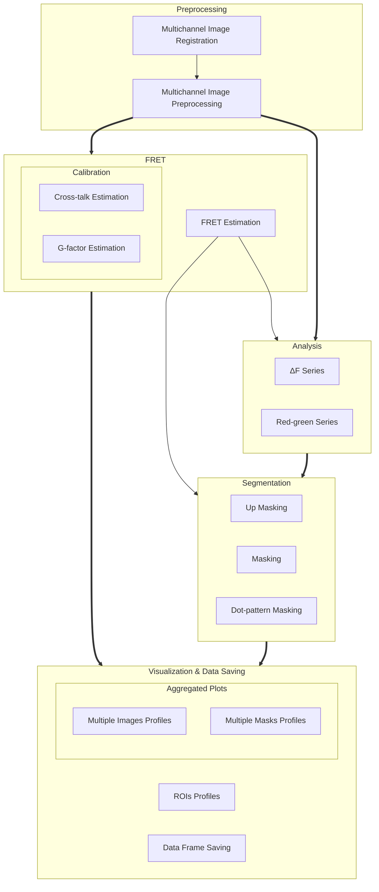
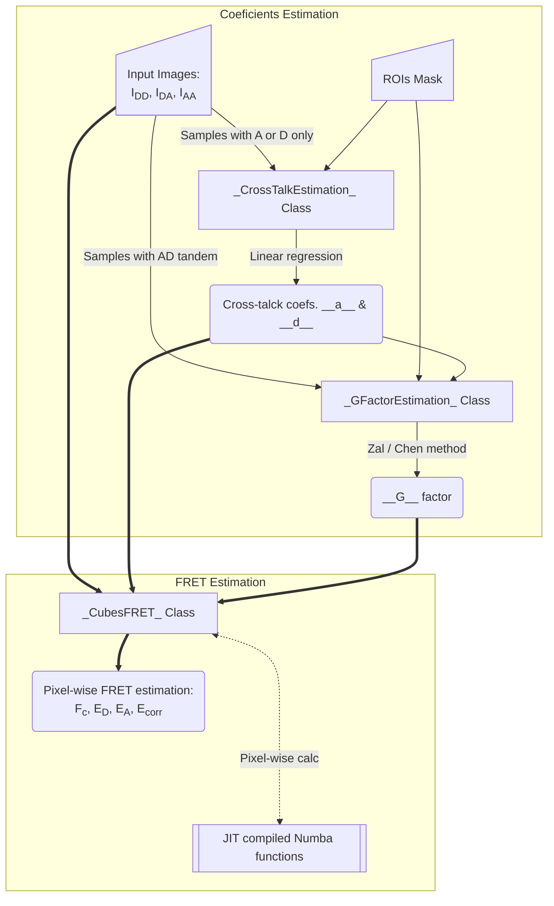

domb-napari
===========

[](https://stand-with-ukraine.pp.ua)

[](https://napari-hub.org/plugins/domb-napari)


[](https://doi.org/10.5281/zenodo.14843770)
<!--  -->

__napari Toolkit of Department of Molecular Biophysics <br /> Bogomoletz Institute of Physiology of NAS of Ukraine, Kyiv,  Ukraine__

This plugin offers widgets specifically designed to analyze the redistribution of fluorescence-labeled proteins in widefield epifluorescence time-lapse acquisitions. It is particularly useful for studying various phenomena, including:
- Calcium-dependent translocation of neuronal calcium sensors.
- Synaptic receptor traffic.
- Membrane protein tracking.


__Hippocalcin (neuronal calcium sensor) redistributes in dendritic branches upon NMDA application__

### Plugin Structure


### E-FRET Module Structure



---


## Preprocessing
### Dual-view Stack Registration
Registration of four-channel image stacks, including two excitation wavelengths and two emission pathbands, acquired with a dual-view beam splitter. This setup detects different spectral pathbands using distinct sides of the camera matrix.

- `offset img` - input for a four-channel time-lapse image stack.
- `reference img` - an optional four-channel reference image (e.g., fluorescence beads image), used for offset estimation if `use reference img` is selected.
- `input crop` - number of pixels that will be deleted from each side of input stack frames to discard misalignment artifacts from the dual-view system.
- `output crop` - number of pixels that will be deleted from each side of output stack frames to discard registration artifacts.


### Multichannel Stack Preprocessing
- `stack order` -  represents the order of axes in the input data array: T (time), C (color), X, and Y (image dimensions). If the input image stack has four dimensions (time, channel, x-axis, y-axis), channels will be split into individual three-dimensional images (time, x-axis, y-axis), each labeled with the `_ch%index%` suffix.
- `median filter` - provides frame-by-frame image smoothing with a kernel of size specified in `median kernel`.
- `background subtraction` -  compensates for background fluorescence intensity. Background intensity is estimated frame by frame as the 0.5 percentile of frame intensity.
- If the `photobleaching correction` option is selected, the image will undergo correction using either an exponential (method `exp`) or bi-exponential (method `bi_exp`) fitting.
- Image stacks can be cropped according to start and stop indexes specified in `frames range` if `drop frames` is selected.


---


## Detection of Fluorescence Redistribution
A set of widgets designed for preprocessing multispectral image stacks and detecting redistributions in fluorescence intensity. These widgets specifically analyze differential "red-green" image series to identify changes in fluorescence intensity.

Inspired by [Dovgan et al., 2010](https://pubmed.ncbi.nlm.nih.gov/20704590/) and [Osypenko et al., 2019](https://www.sciencedirect.com/science/article/pii/S0969996119301974?via%3Dihub).

### Red-Green Series
Primary method for detecting fluorescence-labeled targets redistribution. This widget returns a series of differential images, each representing the intensity difference between the current frame and the previous one, output image labeled with the `_red-green` suffix.

Parameters:

- `left frames` - specifies the number of previous frames used for pixel-wise averaging.
- `space frames` - determines the number of frames between the last left frame and the first right frame.
- `right frames` - specifies the number of subsequent frames used for pixel-wise averaging.

`normalize by int`  function normalizes the differential images relative to the absolute intensity of the input image stack, which helps to reduce background noise amplitude.

If `save MIP` is selected, the maximal intensity projection (MIP) of the differential image stack will be saved with the `_red-green-MIP` suffix.


### ΔF Series
_In progress._


---


## Masking
### Dots Pattern Masking
Creates labels for bright dot elements on an image, such as pre- and postsynaptic fluorescence markers (e.g., Bassoon/Synaptobrevin for presynapses, PSD-95/Homer for postsynapses, etc.). It returns a labels layer with the `_dots-labels` suffix.

The widget detects the location on the MIP (Maximum Intensity Projection) of the input time series image and applies simple round masks to each detected dot. Watershed segmentation is then used to prevent the merging of overlapping masks.

Parameters:

- `background level` - Background level for filtering out low-intensity elements. This is specified as a percentile of the MIP intensity.
- `detection level` - Minimum intensity of dots, specified as a percentile of the MIP's maximum intensity.
- `mask diameter` - Diameter in pixels for the round mask of each individual dot.
- `minimal distance` - Minimum distance in pixels between the centers of individual round masks.


__Hippocalcin (green) and PSD95 (magents) in dendritic branches__


### Up Masking
Generates labels for regions with high intensity based on raw or -red-green images. Returns a labels layer with the `_up-labels` suffix.

The widget provides two detection modes:

- Global masking with a fixed threshold for the entire image.
- In-ROIs masking with a loop over individual ROIs in the input `ROIs mask` with separate detections.

Parameters:

- `det frame index` - index of the frame from the input image used for label detection.
- `det th` - treshold value for detecting bright sites, where the intensity on the selected frame is normalized in the range of -1 to 0.
- `in ROIs det` - option for activating in-ROIs masking.
- `in ROIs det method` - method for in-ROIs masking; otsu provides simple Otsu thresholding, while the threshold method is identical to global detection on nomilized detection frame.
- `in_ROIs_det_th_corr` - caling factor for the det th threshold value for in-ROIs masking.
- `final opening fp` - footprint size in pixels for mask filtering using morphological opening (disabled if set to 0).
- `final dilation fp` - footprint size in pixels for mask morphological dilation (disabled if set to 0).
- `save total up mask` - if selected, a total up mask (containing all ROIs) will be created with the _up-mask suffix.


__Gplobal up labels__

The In-ROIs masking option can be particularly useful for co-localization detection. By applying a broad reference mask to several target images, you can create more precise labels for ROIs in specified cell compartments. The following examples demonstrate the detection of mutual locations for static PSD-95 enriched sites (postsynaptic membranes) and HPCA translocation sites only in the vicinity of synapses, using `_dots-labels` for PSD95-mRFP images.

_Note: In the In-ROIs masking mode, labels of detected sites correspond to the matching labels from the input ROIs mask._

In-ROIs masking (reference)|
:------------------:|:-------------------------:
__In-ROIs maskin (translocation)__|
__Masks overlay__|


### Intensity Masking
Extension of __Up Masking__ widget. Detects regions with increasing (`masking mode` - `up`) or decreasing (`masking mode` - `down`) intensity in `-red-green` images. Returns a labels layer with either `_up-labels` or `_down-labels` suffix, depending on the mode.


---


## 3-cube E-FRET Approach
Widgets for detection and analysis of Förster resonance energy transfer on multispectral image stacks.

Based on notation and approaches from [Zal and Gascoigne, 2004](https://pubmed.ncbi.nlm.nih.gov/15189889/), [Chen et al., 2006](https://pubmed.ncbi.nlm.nih.gov/16815904/) and [Kamino et al., 2023](https://pubmed.ncbi.nlm.nih.gov/37014867/).


### E-FRET Crosstalk Estimation
_In progress._ 

Estimation of the crosstalk/bleed-through of fluorescence between the donor and acceptor’s spectral channels.

```math
F_c = I_{DA} - a (I_{AA} - c I_{DD}) - d (I_{DD} - b I_{AA})
```

```math
F_c = I_{DA} - a I_{AA} - d I_{DD} \; \text{if} \; b \approx c \approx 0
```

```math
a = \frac{I_{DA(A)}}{I_{AA(A)}}
```

```math
b = \frac{I_{DD(A)}}{I_{AA(A)}}
```

```math
c = \frac{I_{AA(D)}} {I_{DD(D)}}
```

```math
d = \frac{I_{DA(D)}} {I_{DD(D)}}
```

```math
b \approx c \approx 0
```

Parameters:
- `DD img` - $I_{DD}$, donor emission channel image acquired with the donor excitation wavelength.
- `DA img` - $I_{DA}$, donor emission channel image acquired with the acceptor excitation wavelength.
- `AD img` - $I_{AD}$, acceptor emission channel image acquired with the donor excitation wavelength.
- `AA img` - $I_{AA}$, acceptor emission channel image acquired with the acceptor excitation wavelength.
- `mask` - .
- `presented_fluorophore` - .
- `saving_path` - .


### E-FRET G-factor Estimation
_In progress._ 

```math
G = \frac{(I_{DA} - a I_{AA} - d I_{DD}) - (I_{DA}^{post} - a I_{AA}^{post} - d I_{DD}^{post})}{I_{DD}^{post} - I_{DD}} = \frac{F_c - F_{c}^{post}}{I_{DD}^{post} - I_{DD}} = \frac{\Delta F_C}{\Delta I_{DD}}
```


```math
\Delta F_c = G \cdot \Delta I_{DD}
```

### E-FRET Estimation
Estimation of the E-FRET with 3-cube approach.

```math
E_{D} = \frac{F_c / G}{F_c / G + I_{DD}}
```


__ECFP and EYFP Setup:__

- Microscope Olympus IX71
- Camera PCO Sensicam QE
- Cube Chroma 69008
- Dual-view system with Chroma 505DCXR beam splitter
- Donor excitation wavelength 435 nm
- Acceptor excitation wavelength 505 nm

__TagBFP and mBaoJin Setup:__

- Microscope Olympus IX71
- Camera PCO Sensicam QE
- Cube Chroma 69002
- Dual-view system with Chroma 505DCXR beam splitter
- Donor excitation wavelength 405 nm
- Acceptor excitation wavelength 495 nm

This method utilizes default values of `a` and `d` coefficients and the `G`-factor for TagBFP and mBaoJin pair. 

Parameters:

- `DD img` - donor emission channel image acquired with the donor excitation wavelength.
- `AD img` - acceptor emission channel image acquired with the donor excitation wavelength.
- `AA img` - acceptor emission channel image acquired with the acceptor excitation wavelength.
- `output type` - type of output image: sensitized emission (`Fc`), apparent FRET efficiency (`Eapp`), or FRET efficiency with photobleaching correction (`Ecorr`).

If the `save normalized` option is selected, an additional image will be saved. This image is normalized to the absolute intensity of the `AA img`, which results in reduced background noise amplitude.

_Note: normalized images are useful for visual control and mask building only; they are not representative for quantitative analysis._

Raw Eapp| 
:-:|:-:
__Normalized Eapp__|


---


## Plotting and Data Frame Saving
### ROIs Profiles
This widget builds a plot with mean intensity profiles for each Region of Interest (ROI) in labels. It uses either absolute intensity (if `absolute intensity` is selected) or relative intensities (ΔF/F0).

Parameters:

- `time scale` - sets the number of seconds between frames for x-axis scaling.
- `values mod` - the mode of output profile calculation. Options are `ΔF/F0` (relative intensity changes), `ΔF` (absolute intensity changes), or `abs` (absolute intensity value)
- `ΔF win`: if the `use_simple_baseline` option is selected, the baseline intensity is estimated as the mean intensity of the specified number of initial profile points. Otherwise, this parameter specifies the window half-size of the moving median baseline estimator (`noisy_median` from the `pybaselines` package).
- `profiles crop` - if selected, only a specified range of intensity profile indexes will be plotted, corresponding to the start and stop indexes from `profiles range`.

Absolute intensity         | 
:-------------------------:|:-------------------------:
__ΔF/F0__|


### Multiple Images Stat Profiles
This widget builds a plot displaying the average intensity of all Regions of Interest (ROIs) specified in `lab`. It can handle up to three images (`img 0`, `img 1`, and `img 2`) as inputs, depending on the selected `profiles num`.

`time scale`, `values mod`, and `ΔF win` parameters are identical as described in the __ROIs profiles__ widget.

The `stat method` allows estimation of intensity and associated errors using the following methods:
- `se` - mean ± standard error of the mean.
- `iqr` - median ± interquartile range.
- `ci` - mean ± 95% confidence interval (t-distribution).

Absolute intensity         | 
:-------------------------:|:-------------------------:
__ΔF/F0__|


### Multiple Labels Stat Profiles
This widget builds a plot displaying the averaged intensity of all Regions of Interest (ROI) for one target `img`. It can handle up to three labels (`lab 0`, `lab 1`, and `lab 2`), depending on the selected `profiles num`.

`time scale`, `values mod`, and `ΔF win` parameters are identical as described in the __ROIs profiles__ widget.

The `stat method` allows estimation of intensity and associated errors using the following methods:
- `se` - mean +/- standard error of the mean.
- `iqr` - median +/- interquartile range.
- `ci` - mean +/- 95% confidence interval based on the t-distribution.

Absolute intensity         | 
:-------------------------:|:-------------------------:
__ΔF/F0__|

### Save Data Frame
This widget enables you to save the data frame in CSV format.
This is particularly useful for exporting results after examining them with the __ROIs Profiles__ widget.

Parameters:

- `img` - input for a single channel time series image stack.
- `lab` - input for a labels layer with ROIs.
- `stim position` - input for a points layer with stimulation electrode position, should contain a single point only.
- `time scale` - sets the number of seconds between frames for frames indexes scaling.
- `ΔF win`: if the `use_simple_baseline` option is selected, the baseline intensity is estimated as the mean intensity of the specified number of initial profile points. Otherwise, this parameter specifies the window half-size of the moving median baseline estimator (`noisy_median` from the `pybaselines` package).
- `save ROIs distances` - if selected, the average distance in pixels from the ROI to the frame will be saved in the data frame.
- `custom stim position` - if selected, a custom stimulation electrode position from `stim position` layer will be used for distance calculations.
- `saving path` - path to save the data frame.

The output data contains the following columns:
- `id` - unique image ID, the name of the input `napari.Image` object.
- `lab_id` - unique label ID, the name of the input `napari.Labels` object.
- `roi` - ROI number, consecutively numbered starting from 1.
- `dist` - average distance in px to the ROI from the frame, (if `save ROIs distances in data frame` option is selected).
- `index` - frame index.
- `time` - frame time point, adjusted according to the `time scale`.
- `abs_int` - absolute intensity value.
- `dF_int` - absolute intensity changes (ΔF).
- `dF/F0_int` - relative intensity changes (ΔF/F0).


---


## How to Cite
If you use this plugin in your work, please cite the following paper:

```
@article{Olifirov2025,
  title = {Local Iontophoretic Application for Pharmacological Induction of Long-Term Synaptic Depression},
  volume = {15},
  ISSN = {2331-8325},
  url = {http://dx.doi.org/10.21769/BioProtoc.5338},
  DOI = {10.21769/bioprotoc.5338},
  number = {1373},
  journal = {BIO-PROTOCOL},
  publisher = {Bio-Protocol,  LLC},
  author = {Olifirov,  Borys and Fedchenko,  Oleksandra and Dovgan,  Alexandr and Babets,  Daria and Krotov,  Volodymyr and Cherkas,  Volodymyr and Belan,  Pavel},
  year = {2025}
}
```

or zenodo:
```
@misc{https://doi.org/10.5281/zenodo.14843770,
  doi = {10.5281/ZENODO.14843770},
  url = {https://zenodo.org/doi/10.5281/zenodo.14843770},
  author = {wisstock,  },
  title = {wisstock/domb-napari: Zenodo release v0.3.0},
  publisher = {Zenodo},
  year = {2025},
  copyright = {MIT License}
}
```